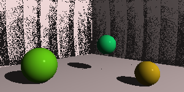

## Raytracer

[](https://travis-ci.com/Pleuvens/RayTracer)
[](https://codecov.io/gh/Pleuvens/Raytracer)

This is a Raytracer in C++ made following The RayTracer Challenge by Jamis Buck

This project is using CMake version 3.15.3-2

## Compile the project

In order to compile this project you need to execute the following commands:

```
prompt$ mkdir build
prompt$ cd build
prompt$ cmake ..
prompt$ make
prompt$ ./Raytracer
```

## Launch Testsuite

In order to launch the testsuite you need to execute the following commands:

```
prompt$ mkdir build
prompt$ cd build
prompt$ cmake .. -DCMAKE_BUILD_TYPE=Test
prompt$ make
prompt$ ./Tests
```

## Current state

Currently I'm working on the scene and shadows.

Here is what this raytracer can render



## Incoming

Planes
Patterns
Reflection and refraction
Cubes
Cylinders
Groups
Triangles
.obj files parsing
Constructive Solid Geometry
Area Lights
Soft Shadows
Spot Lights
Focal Blur
Anti-aliasing
Texture Maps
Normal Perturbation
Torus
Yaml parser
